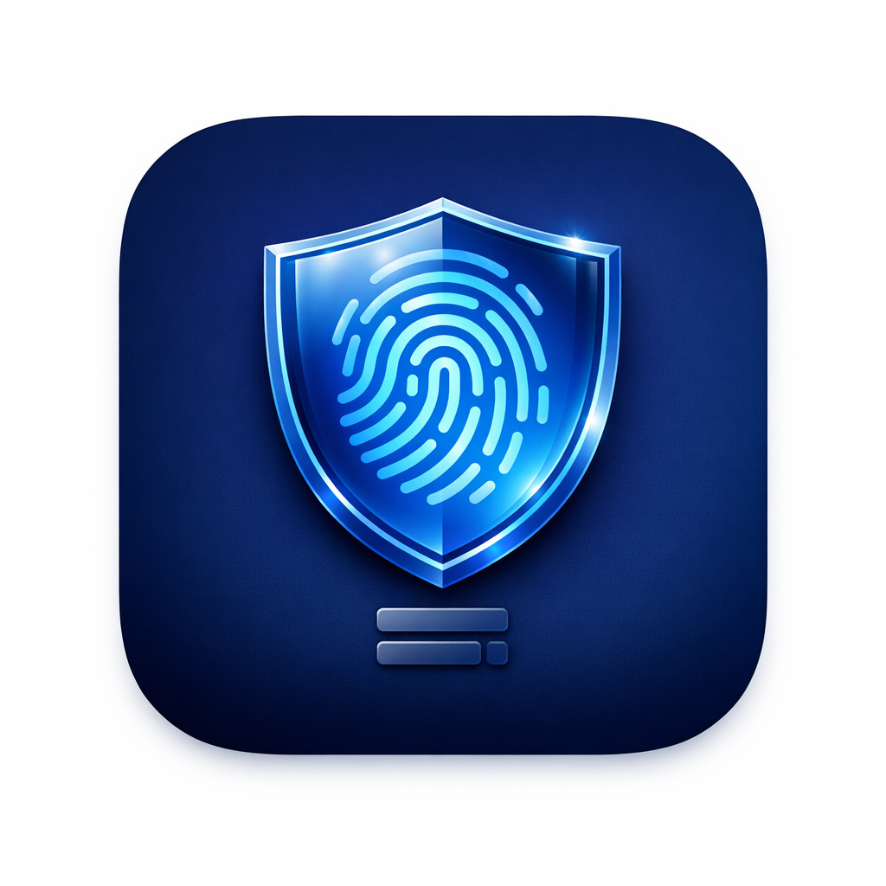
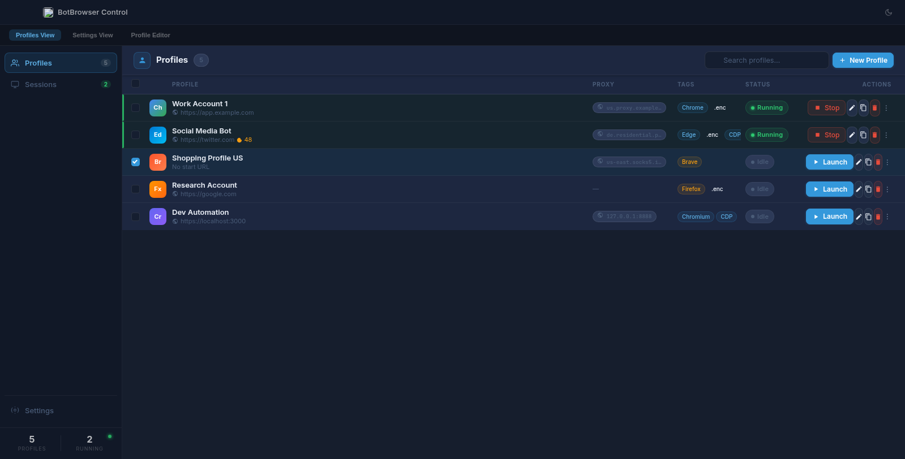
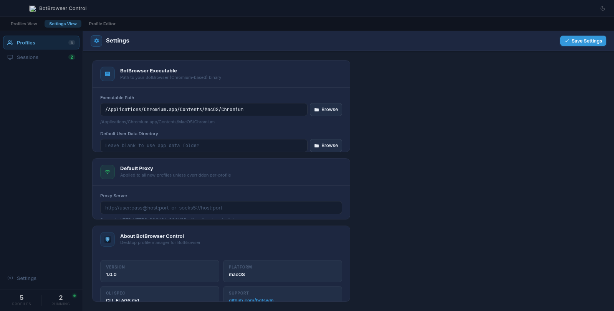
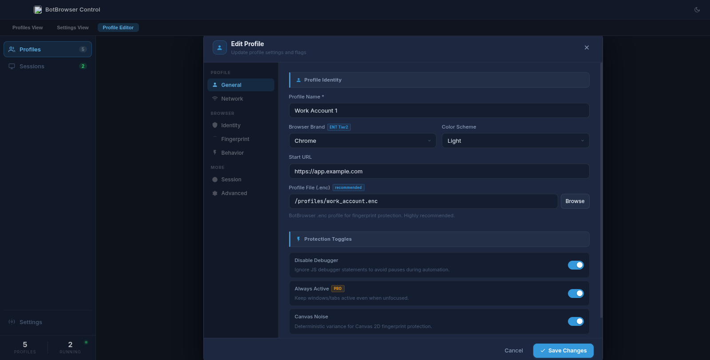

<div align="center">



# BotBrowser Control

**Professional desktop profile manager for [BotBrowser](https://github.com/botswin/BotBrowser)**

[](#)
[](#)
[](#)

[Features](#features) · [Install](#installation) · [Build](#building-from-source) · [Usage](#usage) · [Configuration](#profile-configuration)

</div>

---

## Overview

BotBrowser Control is an open-source Electron desktop application that provides a GoLogin-style GUI for managing and launching [BotBrowser](https://github.com/botswin/BotBrowser) profiles. It handles per-profile user data isolation, fingerprint configuration, proxy assignment, cookie persistence, and live session monitoring — all without touching the command line.

<div align="center">

### Profiles View


### Settings


### Profile Editor


</div>

---

## Features

- **Profile Manager** — Create, edit, duplicate, and delete browser profiles with a clean table UI
- **VS Code-style Profile Editor** — 7-tab sidebar editor (General, Network, Identity, Fingerprint, Behavior, Session, Advanced)
- **One-click Launch / Stop** — Spawn and kill BotBrowser instances per profile
- **Per-profile User Data** — Each profile gets an isolated `--user-data-dir` automatically
- **Proxy Support** — HTTP, HTTPS, SOCKS4, SOCKS5 with credentials, per-profile
- **Fingerprint Configuration** — Map to all BotBrowser `--bot-config-*` flags: locale, timezone, WebGL, WebRTC, canvas noise, seeds, etc.
- **`.enc` Profile File Support** — Load BotBrowser encrypted fingerprint profiles
- **Cookie Persistence** — Auto-save and reload cookies via CDP on stop/start
- **Session Monitor** — Live view of all running browser instances with PID and start time
- **Settings Page** — Configure BotBrowser executable path, default user data directory, default proxy
- **Dark / Light Theme** — Follows system theme; manual override available
- **macOS native** — Hidden titlebar, traffic lights, vibrancy effect
- **Cross-platform** — Works on macOS, Windows, and Linux

---

## Requirements

| Requirement | Version |
|-------------|---------|
| [BotBrowser](https://github.com/botswin/BotBrowser) | Any recent release |
| Node.js | 18 or later |
| npm | 9 or later |

---

## Installation

### Option 1 — Download a pre-built release

Go to [Releases](https://github.com/botswin/BotBrowser/releases) and download the installer for your platform:

| Platform | File |
|----------|------|
| macOS (Apple Silicon) | `BotBrowser.Control-*-arm64.dmg` |
| macOS (Intel) | `BotBrowser.Control-*-x64.dmg` |
| Windows 64-bit | `BotBrowser.Control.Setup-*.exe` |
| Linux (AppImage) | `BotBrowser.Control-*.AppImage` |
| Linux (Debian/Ubuntu) | `botbrowser-control_*_amd64.deb` |

### Option 2 — Run from source

```bash
# 1. Clone the repository
git clone https://github.com/botswin/BotBrowser.git
cd BotBrowser/botbrowser-control   # adjust path if this is a standalone repo

# 2. Install dependencies
npm install

# 3. Launch in development mode
npm start
```

---

## Building from Source

### Prerequisites

```bash
node --version   # v18+
npm --version    # v9+
npm install      # install all dependencies first
```

### Build commands

```bash
# Build for ALL platforms (Mac + Windows + Linux)
npm run build

# macOS only (produces .dmg and .zip for x64 + arm64)
npm run build:mac

# Windows only (produces NSIS installer + portable + zip)
npm run build:win

# Linux only (produces AppImage + .deb + .rpm + tar.gz)
npm run build:linux
```

All artifacts are written to the `dist/` directory.

### Build a specific architecture

```bash
npm run build:mac:x64      # macOS Intel
npm run build:mac:arm64    # macOS Apple Silicon
npm run build:win:x64      # Windows 64-bit
npm run build:win:ia32     # Windows 32-bit
npm run build:linux:x64    # Linux x64
npm run build:linux:arm64  # Linux ARM64
```

### Cross-platform builds

You can build **macOS** and **Linux** targets from any Unix machine. Building **Windows** targets from macOS/Linux requires [Wine](https://www.winehq.org/):

```bash
# macOS
brew install --cask wine-stable

# Ubuntu/Debian
sudo apt install wine64
```

> **Recommended:** Use GitHub Actions to produce official releases for all three platforms in parallel. See [BUILD.md](BUILD.md) for the full workflow YAML.

---

## First-time Setup

1. Launch the app (`npm start` or open the installed `.app` / `.exe`)
2. Click **Settings** in the left sidebar
3. Set the **BotBrowser Executable** path to your BotBrowser binary:
   - macOS: `/Applications/Chromium.app/Contents/MacOS/Chromium`
   - Windows: `C:\Program Files\BotBrowser\chrome.exe`
   - Linux: `/usr/bin/botbrowser`
4. (Optional) Set a **Default User Data Directory** — defaults to `~/Library/Application Support/BotBrowser Control/browser-profiles`
5. Click **Save Settings**

---

## Usage

### Creating a Profile

1. Click **+ New Profile** in the Profiles view
2. Fill in the **General** tab: name, browser brand, start URL, `.enc` profile file
3. Configure **Network** tab: proxy server, IP override
4. Optionally set fingerprint details in **Identity**, **Fingerprint**, **Behavior** tabs
5. Click **Save Changes**

### Launching a Profile

- Click the **▶ Launch** button on any profile row
- The profile opens as a standalone BotBrowser window
- Status changes to **Running** (green pill)
- Click **■ Stop** to close the browser and auto-save cookies

### Managing Sessions

- Click **Sessions** in the left sidebar to see all live instances
- Each entry shows: profile name, PID, start time, and URL
- Use **Stop All** to terminate every running instance at once

### Keyboard Shortcuts

| Action | macOS | Windows / Linux |
|--------|-------|-----------------|
| New Profile | `⌘N` | `Ctrl+N` |
| Go to Profiles | `⌘1` | `Ctrl+1` |
| Go to Sessions | `⌘2` | `Ctrl+2` |
| Go to Settings | `⌘3` | `Ctrl+3` |
| Reload UI | `⌘R` | `Ctrl+R` |
| DevTools | `⌘⌥I` | `Ctrl+Shift+I` |

---

## Profile Configuration

The profile editor maps directly to BotBrowser CLI flags. The most important fields:

| Tab | Field | BotBrowser Flag |
|-----|-------|-----------------|
| General | Browser Brand | `--bot-config-browser-brand` |
| General | Profile File (.enc) | `--bot-profile` |
| General | Start URL | positional argument |
| Network | Proxy Server | `--proxy-server` |
| Network | Proxy IP Override | `--proxy-ip` |
| Identity | Locale | `--bot-config-locale` |
| Identity | Timezone | `--bot-config-timezone` |
| Identity | Color Scheme | `--bot-config-color-scheme` |
| Fingerprint | WebGL | `--bot-config-webgl` |
| Fingerprint | WebRTC | `--bot-config-webrtc` |
| Fingerprint | Canvas Noise | `--bot-config-noise-canvas` |
| Fingerprint | Noise Seed | `--bot-noise-seed` |
| Behavior | Disable Debugger | `--bot-disable-debugger` |
| Behavior | Always Active | `--bot-always-active` |
| Session | Remote Debug Port | `--remote-debugging-port` |
| Session | Bot Script | `--bot-script` |
| Advanced | Custom Headers | `--bot-custom-headers` |
| Advanced | Time Scale | `--bot-time-scale` |

For the full list of supported flags see [BotBrowser CLI_FLAGS.md](https://github.com/botswin/BotBrowser).

---

## Project Structure

```
botbrowser-control/
├── src/
│   ├── main/
│   │   └── main.js          # Electron main process (IPC, browser launch, store)
│   ├── preload/
│   │   └── preload.js       # contextBridge API exposed to renderer
│   ├── renderer/
│   │   ├── index.html       # App shell HTML
│   │   ├── styles/
│   │   │   └── main.css     # Full UI stylesheet (dark theme, GoLogin-inspired)
│   │   └── js/
│   │       └── app.js       # Renderer logic (renderProfiles, editor, settings)
│   └── assets/
│       ├── icon.png         # App icon (1024×1024, used for all platforms)
│       └── logo.svg         # Sidebar SVG logo
├── preview/
│   └── index.html           # Standalone HTML UI preview (no Electron needed)
├── package.json             # Electron + electron-builder config
├── BUILD.md                 # Detailed build instructions
└── README.md                # This file
```

---

## Contributing

1. Fork the repository
2. Create a feature branch: `git checkout -b feature/my-feature`
3. Make your changes
4. Run the app to verify: `npm start`
5. Commit and push: `git push origin feature/my-feature`
6. Open a Pull Request

---

## License

MIT — see [LICENSE](LICENSE) for details.

---

<div align="center">
Made with ♥ for the BotBrowser community · <a href="https://github.com/botswin/BotBrowser">github.com/botswin/BotBrowser</a>
</div>